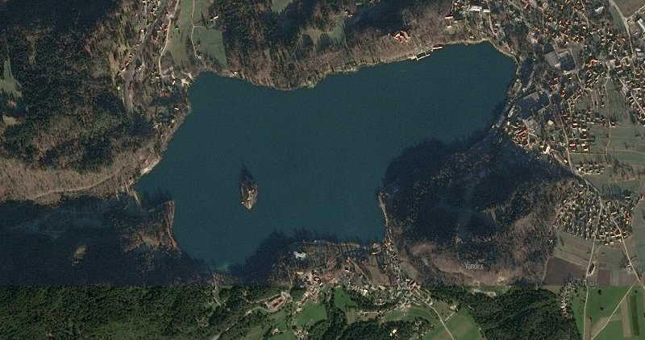

BlEd  II
========

Simplest block editor, made primary 
for [Latid static site generator](https://github.com/girobusan/latid),
as a replacement of currently used block editor. For now at very early stages
of development. 

Goals
------

1. Small footprint
1. Extensible
1. WYSIWYG (almost) 

Origin of name
--------------
**Bled Island** is an island at the center of lake *Bled* in the Julian Alps of the Upper Carniolan region 
of northwestern Slovenia, where it adjoins the town of *Bled*.

<small>They do not bother with naming, and so I am. Just used the abbreviation 
BLok EDitor as name.</small>
